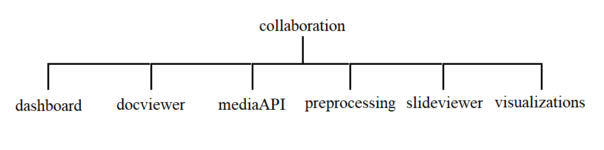

## Collaboration

### Introduction
The release `v1.1.0` of the repository contains functionalities where users can upload multiple image files to the server and view them after upload.

### Prerequisites
+ Django 1.11
+ MySQL
+ Python 3.6

### Getting started
+ Clone the repository using
`git clone https://github.com/Biswajee/Collaboration.git`

+ `cd` into the directory `Collaboration` and create a `python` environment
      Using conda:
      conda create -n collabenv

      using python3:
      python3 -m venv collabenv

+ Activate the environment
      Using conda:
      source activate yourenvname

      Using python3:
      source tutorial-env/bin/activate

+ Type in `pip install requirements.txt` to install required packages

+ Run MySQL client at default port `(:3306)` and start the `MySQL Client`.
Now type in the following: `create database collab;`

+ Now, run the `django database migrations` using:
      python manage.py makemigrations
      python manage.py migrate

+ Now, start the django server using:
      python manage.py runserver

### Navigation and running

Visit the site on `http://127.0.0.1:8000/` to get a set of button links to explore various modules of the application. `:8000` is the default port for running django server. Please make necessary changes if you are running the server on a different port.

### Directory structure

The `dashboard` directory contains utility to upload images and display them.
Static files for website are stored inside `static` directory. The uploaded images are stored in the `media` directory present inside `dashboard` directory.

The directory level view of the project :
```
C:.
├───collaboration
│   └───__pycache__
├───dashboard
│   ├───migrations
│   │   └───__pycache__
│   ├───static
│   │   ├───css
│   │   └───js
│   ├───templates
│   │   └───dashboard
│   │       └───includes
│   └───__pycache__
├───docviewer
│   ├───migrations
│   │   └───__pycache__
│   ├───static
│   │   ├───css
│   │   └───js
│   ├───templates
│   │   └───docviewer
│   │       └───includes
│   └───__pycache__
├───media
│   └───ImageAPI
├───mediaAPI
│   ├───migrations
│   │   └───__pycache__
│   ├───static
│   │   ├───css
│   │   └───js
│   ├───templates
│   │   └───mediaAPI
│   │       └───includes
│   └───__pycache__
├───preprocessing
│   └───.ipynb_checkpoints
├───release_videos
├───slideviewer
│   ├───migrations
│   │   └───__pycache__
│   ├───static
│   │   ├───css
│   │   └───js
│   ├───templates
│   │   └───slideviewer
│   │       └───includes
│   └───__pycache__
└───visualizations
    ├───migrations
    │   └───__pycache__
    ├───static
    │   ├───css
    │   ├───js
    │   └───json
    ├───templates
    │   └───visualizations
    └───__pycache__
```
### Module details

The `collaboration` project is divided into 6 modules for performing 5 different tasks as directed in **Collaborative Communities** section. A high level overview is depicted below:



The detail description for each of the modules are as follows:

+ **dashboard** - This module contains an _Image Gallery_ in django where users can upload as many images (upto 6 images) and the result will be displayed into another page on clicking the _create_ button.

  URL description for the module:

  > `http://127.0.0.1:8000/` - Base URL that contains button links to various modules of the application.

  > `http://127.0.0.1:8000/image_upload/` - URL to upload image files to the server.

  > `http://127.0.0.1:8000/image_list/` - URL is directed to when the form in `/image_upload/` is submitted. This URL displays the images uploaded by user.

+ **docviewer** - This module contains a document upload section where document files can be uploaded and viewed in another page after the upload form is submitted. The max. number of allowed files is 6.

  URL description for the module:

  > `http://127.0.0.1:8000/doc/doc_upload/` - URL to upload document files to server.

  > `http://127.0.0.1:8000/doc/doc_view/` - On submitting the form on `/doc/doc_upload/` page, the uploaded files can be viewed in this URL.

+ **slideviewer** - This module contains a presentation upload section where presentation files can be uploaded and viewed in another link. The max. number of uploads being 6.

  URL description for the module:

  > `http://127.0.0.1:8000/slide/slide_upload/` - URL to
upload presentation files to the server.

  > `http://127.0.0.1:8000/slide/slide_view/` - URL is triggered when the form on `/slide/slide_upload/` is submitted. This URL displays each slides of the presentation in a file format. The contents of slides can only be viewed but not edited.

+ **mediaAPI** - This module contains a service that allows uploading image files to the server, updating specific image files based on their **id** , deleting image files rom the server and returning an API to access all images present in server database.

###### Note : This module does not interact with **dashboard** module in any way. The image files are also saved in a location different from that of **dashboad** and databases for each modules are separate.

  URL description for the module:

  > `http://127.0.0.1:8000/api/` - Form endpoint to upload image files for API usage.

  > `http://127.0.0.1:8000/api/all_images/` - This endpoint returns a JSON formatted response containing data of all images stored in the database and their file path reference.

  Sample JSON response:

  ```
  [
    {
    "id": 3,
    "name": "Compass",
    "description": "This is a compass",
    "image": "media/ImageAPI/compass.jpg",
    "created_by": "Navigation dept"
    }
  ]
  ```
  > `http://127.0.0.1:8000/api/images/id=IMAGE_ID` - This endpoint returns the JSON formatted response for a specific image(already existing in database). Invalid IDs will result in error.

  Sample JSON response for `IMAGE_ID = 3`:

  ```
  {
    "id": "3",
    "url": "http://127.0.0.1:8000/media/media/ImageAPI/compass.jpg"
  }
  ```

  > `http://127.0.0.1:8000/api/delete_image/?id=IMAGE_ID` - Deletes image with the given `IMAGE_ID` as parameter both from the database and the file system and returns a JSON formatted response when the action is successfully performed.

  Sample successful delete JSON response for `IMAGE_ID = 5`:
  ```
  {
    "id": "5",
    "status": "deleted"
  }
  ```

  If no `id` parameter is passed to the URL `http://127.0.0.1:8000/api/delete_image/`, it results in a JSON formatted error response as:

  ```
  {
    "error": "You need to pass in parameters"
  }
  ```

  > `http://127.0.0.1:8000/api/update_image` - This endpoint results in a form page where the ID of an existing image in database can be entered and a new image can be uploaded and the image corresponding to the given ID will get updated with the newly updated image relative path in the database.

+ **visualizations** - This module holds a simple web application that uses D3.js to display data from json file.

  URL description for the module:

  > `http://127.0.0.1:8000/d3/` - D3.js uses the data stored in `visualizations/static/json/data.json` to create data points in the given URL. <br>
  The data.json has been developed using the **preprocessing** module which is not a part of the django project but can be run independently to produce the `data.json` file.

### Additional files and related discussion:

The django application requires some additional inclusions before running the application otherwise the application can run into errors.

+ **media** - Please create a media directory under the project folder. This directory will store all uploaded files from the user to this location and will use this location as reference to deliver files in JSON responses.

  Tree View:
  ```
  ├───collaboration
  ├───dashboard
  ├───docviewer
  ├───media     // place the directory at this level
  ├───mediaAPI
  ├───preprocessing
  ├───release_videos
  ├───slideviewer
  └───visualizations
  ```

+ **preprocessing** - This directory isn't necessary for running the django application. This directory is used to prepare the `data.json` file used by the **visualizations** module. Please refer to further documentation under preprocessing directory [here](preprocessing/readme.md)   


### Release v1.0.0 demonstration:


